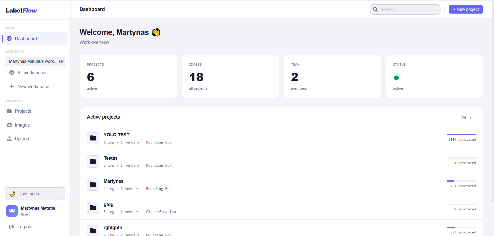
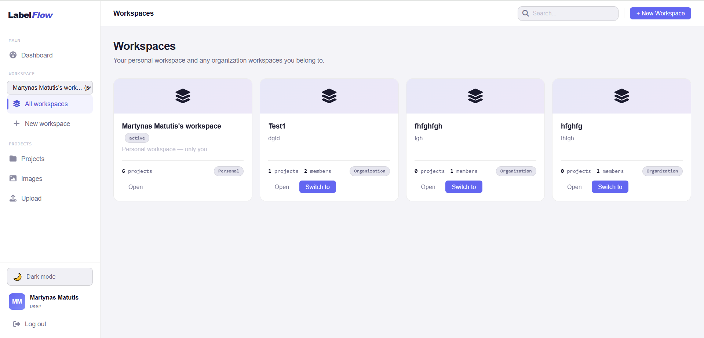
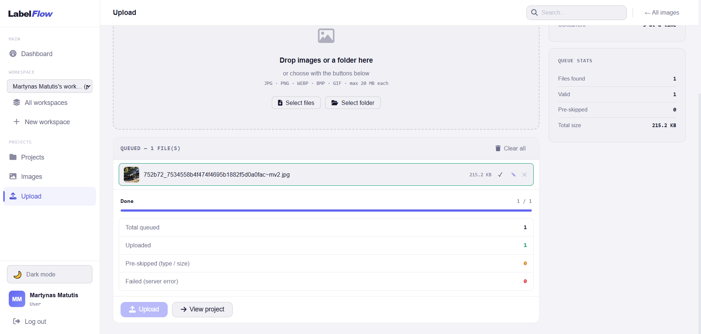
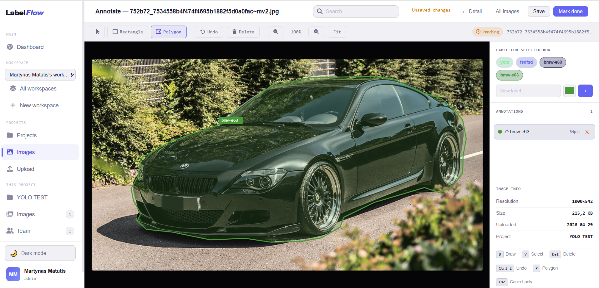

# LabelFlow

**LabelFlow** is a Django-based web application developed as a **team / university project**. The goal is to provide a platform for managing image-labeling workflows — from organizing projects and teams to annotating images with bounding boxes and polygons.

---

## Screenshots

| Dashboard | Workspaces |
|---|---|
|  |  |

| Image Upload | Annotation Canvas |
|---|---|
|  |  |

---

## Project Context

| Field | Details |
|---|---|
| **Project type** | University / Team Project |
| **Backend** | Django 6 |
| **Frontend** | HTML, CSS, JavaScript |
| **Database** | SQLite (default) |
| **Version control** | Git & GitHub |
| **Collaboration model** | Feature-based development with pull requests |

---

## Features

- User registration & login
- User profiles
- Personal and organization workspaces
- Project and team management with role-based access (admin / annotator)
- Workspace invitations via email
- Image upload with drag-and-drop (JPG, PNG, WEBP, BMP, GIF)
- Bounding box and polygon annotation canvas
- YOLO export
- Activity log per project
- Dark mode

---

## Project Structure

```text
LabelFlow/
├── manage.py
├── requirements.txt
├── labelflow/                  # Django project configuration
│   ├── settings.py
│   ├── urls.py
│   └── wsgi.py
├── apps/
│   ├── accounts/               # Registration, login, profiles
│   ├── projects/               # Workspaces, projects, teams, invitations, activity
│   └── images/                 # Image upload, annotation, tags, export
├── static/
│   ├── css/
│   ├── js/
│   └── images/
├── templates/                  # HTML templates
│   ├── app/
│   ├── email/
│   └── registration/
├── media/                      # User-uploaded files (gitignored)
└── .github/                    # README screenshots
```

---

## Requirements

- Python 3.12+
- pip
- Git

**Check versions:**
```bash
python --version
pip --version
```

---

## Setup & Run

### 1. Clone the repository

```bash
git clone https://github.com/MartynasMatDev/LabelFlow.git
cd LabelFlow
```

### 2. Create and activate virtual environment

**Linux / macOS:**
```bash
python -m venv venv
source venv/bin/activate
```

**Windows:**
```bash
python -m venv venv
venv\Scripts\activate
```

### 3. Install dependencies

```bash
pip install -r requirements.txt
```

### 4. Run migrations

```bash
python manage.py migrate
```

### 5. Create superuser *(optional)*

```bash
python manage.py createsuperuser
```

### 6. Start development server

```bash
python manage.py runserver
```

Open: [http://127.0.0.1:8000/](http://127.0.0.1:8000/)

---

## Development Commands

```bash
python manage.py makemigrations
python manage.py migrate
python manage.py test
```

---

## Branching Strategy

> **Direct pushes to `main` are not allowed.**

```text
feature/* → dev → main
bugfixes/* → dev → main
```

| Branch | Purpose |
|---|---|
| `main` | Stable, production-ready code |
| `dev` | Integration branch |
| `feature/*` | New features |
| `bugfixes/*` | Bug fixes |

---

## API Usage (PowerShell)

LabelFlow exposes a small REST API for uploading and annotating images directly from a terminal. The examples below use **Windows PowerShell**.

> **Prerequisites**
> - The dev server is running: `python manage.py runserver`
> - You have an account on the running instance
> - Open a **new** terminal and activate your virtualenv:
>   ```powershell
>   cd C:\path\to\LabelFlow
>   venv\Scripts\activate
>   ```

### Authentication — Get an API token

Run once per session. Replace `REAL_USERNAME` / `REAL_PASSWORD` with your credentials. The token is stored in `$token` for the commands that follow.

```powershell
$login = Invoke-WebRequest -Method POST `
  -Uri "http://127.0.0.1:8000/app/images/api/token/" `
  -ContentType "application/json" `
  -Body '{"username": "REAL_USERNAME", "password": "REAL_PASSWORD"}' `
  -UseBasicParsing
$token = ($login.Content | ConvertFrom-Json).token
Write-Host "Token:" $token
```

---

### Upload images

**1. Find your project ID** in the project page URL:

```text
http://127.0.0.1:8000/app/images/project/4/
                                         ↑
                                   projectId = 4
```

**2. Set up the upload helper.** Replace the placeholder values with your own token and project ID:

```powershell
Add-Type -AssemblyName System.Net.Http
$token     = "YOUR_TOKEN_HERE"
$projectId = "YOUR_PROJECT_ID"

function Upload-Image($path) {
    $client = New-Object System.Net.Http.HttpClient
    $client.DefaultRequestHeaders.Add("Authorization", "Token $token")

    $content = New-Object System.Net.Http.MultipartFormDataContent
    $content.Add((New-Object System.Net.Http.StringContent($projectId)), "project")

    $bytes = [System.IO.File]::ReadAllBytes($path)
    $file  = New-Object System.Net.Http.ByteArrayContent(, $bytes)
    $file.Headers.ContentType = [System.Net.Http.Headers.MediaTypeHeaderValue]::Parse("image/png")
    $content.Add($file, "image_file", [System.IO.Path]::GetFileName($path))

    $client.PostAsync("http://127.0.0.1:8000/app/images/api/upload/", $content).Result.Content.ReadAsStringAsync().Result | ConvertFrom-Json
}
```

**3. Upload one or more images:**

```powershell
Upload-Image "C:\Users\abc\photo.png"
Upload-Image "C:\Users\abc\another_photo.png"
```

---

### Annotate images

**1. Find your image ID** in the annotation page URL:

```text
http://127.0.0.1:8000/app/images/67/annotate/
                                 ↑
                            imageId = 67
```

#### List annotations on an image

```powershell
Invoke-WebRequest -Method GET `
  -Uri "http://127.0.0.1:8000/app/images/api/images/67/annotations/" `
  -Headers @{ Authorization = "Token $token" } `
  -UseBasicParsing | Select-Object -ExpandProperty Content
```

#### Add a bounding box

`x`, `y`, `width`, `height` are percentages of the image size (0–100).

```powershell
Invoke-WebRequest -Method POST `
  -Uri "http://127.0.0.1:8000/app/images/api/images/88/annotations/" `
  -Headers @{ Authorization = "Token $token" } `
  -ContentType "application/json" `
  -Body '{"type":"bbox","x":10.5,"y":20.0,"width":30.0,"height":25.0}' `
  -UseBasicParsing | Select-Object -ExpandProperty Content
```

#### Add a polygon

Minimum 3 points. Each `x` / `y` is a percentage (0–100).

```powershell
Invoke-WebRequest -Method POST `
  -Uri "http://127.0.0.1:8000/app/images/api/images/88/annotations/" `
  -Headers @{ Authorization = "Token $token" } `
  -ContentType "application/json" `
  -Body '{"type":"polygon","points":[{"x":10,"y":10},{"x":50,"y":10},{"x":30,"y":50}]}' `
  -UseBasicParsing | Select-Object -ExpandProperty Content
```

#### Delete an annotation

First list annotations to find the ID (e.g. `"boxes": [{"id": 11, ...}]`), then delete by type (`bbox` or `polygon`) and annotation ID:

```powershell
Invoke-WebRequest -Method DELETE `
  -Uri "http://127.0.0.1:8000/app/images/api/annotations/bbox/11/" `
  -Headers @{ Authorization = "Token $token" } `
  -UseBasicParsing | Select-Object -ExpandProperty Content
```

---

### Endpoint summary

| Method | Endpoint | Purpose |
|---|---|---|
| `POST` | `/app/images/api/token/` | Obtain an API token |
| `POST` | `/app/images/api/upload/` | Upload an image to a project |
| `GET`  | `/app/images/api/images/<image_id>/annotations/` | List annotations on an image |
| `POST` | `/app/images/api/images/<image_id>/annotations/` | Add a bbox or polygon annotation |
| `DELETE` | `/app/images/api/annotations/<type>/<annotation_id>/` | Delete an annotation |

---

## License

This project is created for educational purposes.
